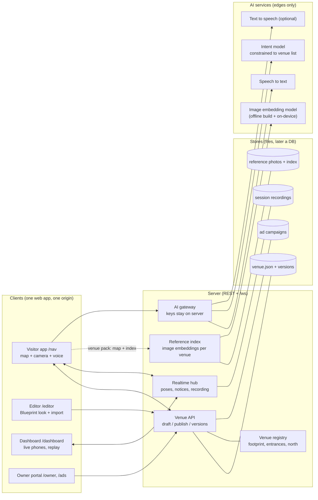
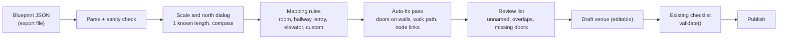
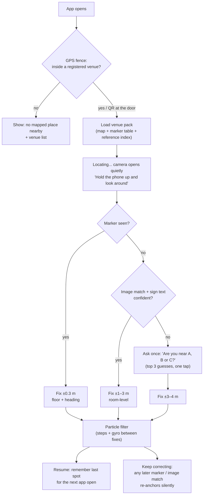
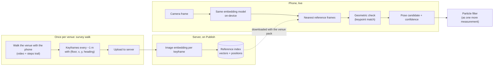
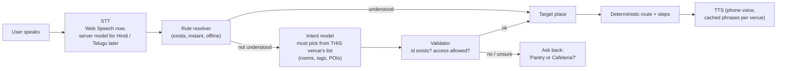
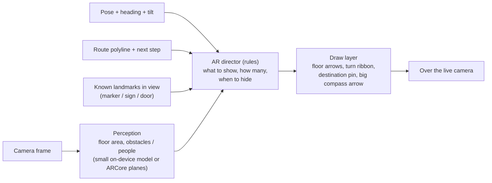
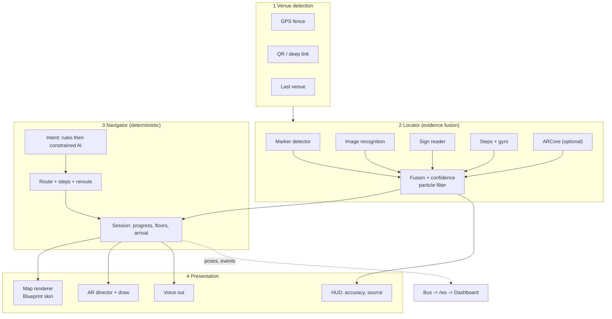

# Architecture v2 — Blueprint look, automatic location, AI at the edges, real AR

Status: **plan only, no code written.** Nothing in this document changes what runs today.
Builds on: `01-codebase-analysis-and-plan.md`, `02-decisions-mapping-and-positioning.md`, `03-build-plan.md`, `PROGRESS.md`.
Diagrams are Mermaid. View them in VS Code with the extension "Markdown Preview Mermaid Support" (or on GitHub).

---

## 1. What you asked, and the short answers

| # | Question | Short answer |
|---|---|---|
| 1 | Why can't we design floors in the Blueprint editor? | We can use it as the **look** and as an **import source**. We cannot use its file as the **data model**: it has no scale, no doors, no walkable paths, no markers. Our venue file keeps all of that. Plan: Blueprint skin + Blueprint importer, nothing lost (§4, §6). |
| 2 | Can the app know where I am without me telling it, and without AI? | **Which building: yes, deterministic** (GPS fence + QR). **Which room / floor / spot: yes**, but only by looking through the camera (markers today, image recognition next). A plain web page cannot read Wi-Fi, Bluetooth or the barometer, so there is no "zero-action Google-Maps blue dot" in a browser. What we can do: open the app, hold the phone up for 2–4 seconds, and it locks on by itself (§5). |
| 3 | What is the complexity, can we implement it? | Yes. Building detection: days. Marker auto-lock: days (mostly done). Image-based recognition: 3–5 weeks plus a photo-survey of each building. Effort table in §5.4. |
| 4 | Where should AI be used? | Only at the edges: speech-to-text, text-to-speech, "I want a coffee → Pantry", and image recognition. **Routes, steps, positions, map drawing and AR placement stay deterministic and testable** (§7). |
| 5 | AR is not working | Cause found and fixed this session for phones without ARCore (the camera was never shown). Remaining AR work is calibration and "where to draw" rules (§8). |
| 6 | Keep everything we have | Yes. §10 lists what is frozen and the test gates that protect it. |

---

## 2. Principles

1. **One source of truth: the venue file** (`venue.json`, schema v2). Every screen is a view of it. Importers and editors only produce it; they never become a second model.
2. **Deterministic core, AI at the edges.** Anything that must be right (route, distance, "turn left in 4 m") is plain code with tests. AI proposes; code validates; if AI is offline there is always a rule-based fallback.
3. **Evidence, not a single sensor.** Location = several weak clues (GPS fence, marker, image match, sign text, steps) fused with the particle filter we already have, with an honest accuracy number.
4. **Ask last.** Manual "where are you?" becomes the final fallback, shown as "Are you near A / B / C?" (one tap), never the first screen.
5. **Nothing is lost.** Each phase ships behind the existing test gates (491 unit tests, e2e, golden route tests).

---

## 3. Target architecture (system view)

**What is new vs today:** the Venue registry, the Reference index, and the AI gateway. Everything else exists.

---

## 4. The map: Blueprint look, our data

### 4.1 Decision

Use **one scene model, two skins**.

- Scene model = the venue file (rooms, corridors, doors, objects, markers) — unchanged.
- **Blueprint skin** = the classy look you like (proper wall thickness, door-swing arcs, furniture icons, soft floor fills, crisp labels, north arrow, dimension chips). Used in the visitor map **and** the editor.
- **Editor skin** adds handles, grid and checklist on top. Visitor skin hides them.

Today `ui/map/layers.tsx` already draws everything from the venue file; the work is a richer **theme** for those layers (not a new renderer, not a new data format).

### 4.2 Why the Blueprint file itself cannot be the model

Observed in the export you selected (`blueprint_export_2026-10-02…json`):

| Blueprint file | Problem for navigation | How we handle it |
|---|---|---|
| Pixel rectangles, **no scale** | Distances, step counts, ETA need metres | Import dialog asks for one known length (e.g. a door = 0.9 m) → scale |
| `trueNorth: 0` only | Compass/AR need real orientation | Kept as `northOffsetDeg` in the venue |
| `entry` = thin rectangles | Not tied to a room wall | Snap each entry to the nearest room edge → a **door** (and link to the walk path) |
| `hallway` = one fat rectangle | No walk line | Centre line + width → a **corridor line with width** |
| `elevator` ×3, no floor link | Lift needs floors | Imported as lift rooms; you confirm which floors they join |
| `custom` ×3 incl. a 1260×568 box over everything | Overlaps hide real rooms | Box ⇒ floor outline; named ones ⇒ rooms; unnamed ⇒ flagged |
| Rooms named "New room", "New custom" | Can't be searched | Review list: rename before publish |
| Rooms can overlap | Routing/validation ambiguity | Review list flags overlaps (the checklist we already have) |

### 4.3 Import pipeline

After import you keep editing in `/editor` (all current tools: furniture, many doors, L-shaped rooms, corridor lines). The legacy `/legacy-editor` stays until import parity is proven, then is retired.

### 4.4 "Only our venues, not the whole world"

- The visitor app shows **no base map**. The first screen is "You are at **Indore Office – Block A**" (auto-detected, §5.2) or "No mapped place nearby" with the list of venues.
- Venue footprint + entrances come from Google Maps / OpenStreetMap **once, by hand** (no paid API needed) and are stored in the **Venue registry**.

---

## 5. Automatic location

### 5.1 What is physically possible in a browser

| Signal | Web page can use it? | Gives | Verdict |
|---|---|---|---|
| GPS / network location | Yes (`geolocation`) | ±10–50 m indoors, no floor | Use for **which building**, not where inside |
| Camera + markers (ArUco) | Yes — built | ±0.3–0.5 m, floor, heading | Primary precise fix |
| Camera + image recognition | Yes (on-device model) | Room-level, ~1–3 m | **Next big step** (§5.3) |
| Camera + reading signs (OCR) | Yes | Room-level when a sign is visible | Cheap extra clue |
| Steps + gyro (PDR) | Yes — built | Continuous motion between fixes | Keeps the dot moving |
| ARCore tracking (WebXR) | Only phones with ARCore | Smooth motion | Optional boost |
| Wi-Fi scan / RTT | **No** | — | Native app only |
| Bluetooth beacons | **No** (not usable in Chrome) | — | Native app only |
| Barometer (floor) | **No** | — | Floor from marker / ask once |
| UWB | **No** | — | Not relevant |

So "like Google Maps, no action" is not achievable **in a web app**. Google's indoor dot uses Wi-Fi/BLE data and Google's own image database — inputs a web page cannot read. The honest target: **open the app → hold the phone up for a few seconds → locked, no typing.**

### 5.2 Automatic flow

Rules:
- **Confidence gate**: lock automatically only above a threshold; otherwise fall to the next rung. Wrong-lock is worse than asking.
- **Hysteresis**: a second match 3 s later must agree before the dot jumps more than 3 m.
- The particle filter (walls, doors, corridors) already rejects impossible jumps.

### 5.3 Image-based recognition ("vision AI that knows the cues")

What you described — a model that has seen the rooms and recognises where a new camera frame was taken — is **visual place recognition**. It is a learned *image-matching* model, not a chat/LLM.

How it works here:

- **LLM vision is NOT used for position.** Too slow (seconds), costs per frame, cannot give metres, can invent answers. A small embedding model runs on the phone in tens of milliseconds, offline, free per use.
- Works well where rooms look different; **struggles with identical corridors, blank white walls, dim light** (typical PG). Mitigation: keep 4–6 printed markers as anchors, add distinctive wall posters, and let the filter + OCR resolve ties.
- **Privacy**: camera frames are processed on the phone; only the owner's survey photos are stored on the server.
- **Measured, not promised**: an evaluation harness holds back survey photos and reports room-level hit rate, median error, wrong-lock rate before we turn it on. Targets: room ≥ 90 %, median ≤ 2 m, wrong-lock ≤ 3 %.

### 5.4 Complexity and effort

| Capability | Complexity | Effort (1 dev) | Accuracy | Needs |
|---|---|---|---|---|
| Venue detection (GPS fence, QR) | Low | 3–4 days | building | Footprint polygon per venue |
| Auto-lock from markers + "Locating…" screen | Low | ~1 week | ±0.3–0.5 m | Printed markers (have the generator) |
| Evidence fusion + confidence + 3-guess fallback | Medium | included above | — | — |
| Sign reading (OCR) | Medium | 3–5 days | room | Visible signs |
| Image recognition + survey tool + index | **High** | 3–5 weeks | room / 1–3 m | One survey walk per venue, good light |
| Native wrapper for BLE / Wi-Fi RTT / barometer | **Very high** | 6+ weeks | 1–3 m | Hardware (beacons / Wi-Fi 6 APs); only if the above is not enough |

**Can we implement it? Yes**, in this order. For the PG (small, repetitive walls) markers + a few distinctive cues are the right tool. For the office image recognition pays off.

---

## 6. Venue data additions (names only, additive, schema stays backward compatible)

| Addition | Purpose |
|---|---|
| `venue.geo`: anchor lat/lng, rotation, footprint polygon, entrance list | GPS fence, QR entry, outdoor→indoor hand-off |
| `venue.northOffsetDeg` (from Blueprint `trueNorth`) | Compass and AR heading alignment |
| `room.tags[]` (semantic: coffee, tea, snacks, wash hands, printing, quiet) | "I want a coffee" → Pantry without needing AI for common asks |
| `venue.references` (pointer to the reference index) | Image recognition pack |
| `venue.theme` (skin choice) | Blueprint look per venue |

Existing venues keep working with none of these set.

---

## 7. Where AI is used (and where it is not)

| Area | AI? | Why |
|---|---|---|
| Route, steps, ETA, reroute | **No** | Must be exact and testable |
| Map drawing, editor, validation | **No** | Deterministic |
| Position fusion (particle filter) | **No** | Classical, explainable |
| Speech → text | **Yes** | Hard problem, good services exist |
| "I want a coffee" → target | **Yes, constrained** | Output limited to ids in this venue; code validates; rule fallback offline |
| Text → speech | **Optional** | Phone voice works; server voices improve Hindi/Telugu |
| Image recognition for location | **Yes (small model)** | §5.3 |
| AR placement | **Perception only** (§8) | Decision policy stays code |

Guard rails: the model never invents places (closed list), never gets raw camera frames, keys stay on the server (AI gateway), every call has a timeout and a rule-based fallback, and a test corpus (like `intent-corpus.test.ts`) measures it.

---

## 8. Augmented reality

### 8.1 Decision on "AI decides where to show AR"

Where an arrow goes is geometry: the route line, the user's pose and the camera tilt. Letting a language model decide that would be slow and unsafe. **AI helps perception; a rule engine decides what to draw.**

AR director rules (deterministic, unit-tested):
- Draw floor arrows only **on detected floor**; never on people or walls.
- Show at most N cues; turn cue appears within ~15 m of the turn.
- If position accuracy is worse than ~2 m, hide world-anchored cues and show **only the big compass arrow** (already built).
- When a marker or sign is in view, **snap** the overlay to it (kills drift).
- Stairs / lift cue only near the vertical door.

### 8.2 Status and remaining work

| Part | State |
|---|---|
| Camera view on phones without ARCore (live camera + arrows + big arrow + "Where to?") | **Done this session** (needs your phone test) |
| WebXR path (phones with ARCore) | Exists, untested on your phone |
| Heading calibration (north offset + gyro/compass fusion) | To do — biggest accuracy lever for arrows |
| Floor detection / obstacle masking | To do |
| AR director rules + declutter | To do |
| Field tests with measured arrow alignment | To do (template in `field-tests.md`) |

---

## 9. Visitor app internals (target)

Existing modules map onto this: `positioning/*` (Locator), `navigator/*` + `core/route.ts` (Navigator), `ui/map/*` + `ar/*` (Presentation), `bus/*` + `server/ws.ts` (Bus). The new parts are the Detect box, the VPR/OCR boxes, the fusion confidence layer, the AR director and the skin.

---

## 10. What stays exactly as it is (no-loss list)

- Venue schema v2, the editor tools (furniture, many doors, L-shaped/polygon rooms, corridor lines with width, snapping toggle), Publish/versions/rollback.
- Routing with pass-through rule, stairs/lift options, avoid-stairs, reroute.
- Particle filter, ArUco markers, XR + step-counting sources, WebSocket bus, dashboard (live, replay).
- Ads and campaigns, owner portal, preflight and spikes pages.
- Venues `office-hq`, `my-pg`, `pg-home` and their drafts/versions.
- **Gates for every phase:** `npm run typecheck`, `npm test` (491 today), `npm run e2e`, golden route tests unchanged. A phase is not "done" if any gate regresses.

---

## 11. Implementation plan

Order is chosen so each phase gives something you can use and test on a phone, and the risky one (image recognition) comes after the data and map foundations.

| Phase | Name | What you can do after it | Effort | Depends on |
|---|---|---|---|---|
| **P1** | Blueprint-quality map skin | Visitor map and editor look like Blueprint (wall thickness, door arcs, icons, labels, north arrow, you-are-here cone). Same data. | 1–1.5 wk | — |
| **P2** | Blueprint importer + scale/north | Import your Blueprint export, set scale once, review list, publish. Retire `/legacy-editor` when parity is shown. | ~1 wk | — (parallel to P1) |
| **P3** | Venue registry + auto-venue | App opens straight into the right building (GPS fence / QR); no world map; "no mapped place" state. | 3–4 days | P2 (footprint, north) |
| **P4** | Auto-locate v1 (no ML) | "Locating…" screen replaces manual-first; marker auto-lock; fusion + confidence; one-tap "Are you near…?"; remembers last spot. | ~1 wk | P3 |
| **P6** | Voice and AI intents | "I want a coffee" → Pantry; room tags; constrained AI resolver + validator; better STT for Hindi/Telugu; cached TTS. | ~1 wk | P2 (tags) |
| **P7** | AR finish | Heading calibration, floor/obstacle masking, AR director, measured alignment on your phone. | 2–3 wk | P4 |
| **P5** | Image recognition | Survey-walk tool, index build on Publish, on-device matcher, evaluation harness; fuse into the filter. Turn on only when targets in §5.3 are met. | 3–5 wk | P3, P4 |
| **P8** | Native wrapper (only if needed) | BLE / Wi-Fi RTT / barometer if P5 accuracy is not enough. | 6+ wk | P5 result |

Suggested sequence: **P2 → P1 → P3 → P4 → P6 → P7 → P5 → (P8)**. P1 and P2 run side by side. P6 can move earlier if voice matters most.

Rough total for P1–P7 with one developer: **9–12 weeks**. P5 is the main uncertainty.

### Per-phase acceptance (examples)

- **P1** Side-by-side screenshots approved by you; no change to any golden/route test.
- **P2** Your export imports to a publishable venue after only renames and one scale entry; round-trip: import → publish → `/nav` shows it.
- **P3** Standing at the office entrance the app opens the office with zero taps; outside, it says "no mapped place".
- **P4** From app open to a locked position in ≤ 5 s when a marker is visible; wrong-lock never silently accepted; manual only after two failed attempts.
- **P5** Held-out photos: room hit-rate ≥ 90 %, median error ≤ 2 m, wrong-lock ≤ 3 %.
- **P6** Intent corpus (English/Hinglish/Telugu) ≥ 95 % correct or "asks back"; 0 invented places.
- **P7** Walk a 20 m route: arrow lands on the real corridor within ~1 m (to be measured, then written in `PROGRESS.md`).

---

## 12. Risks and decisions I need from you

| # | Question / risk | Why it matters |
|---|---|---|
| 1 | **Scale of the Blueprint file** — what real length is one pixel (or one known door/room)? | Without it every distance is wrong |
| 2 | Is the Blueprint export final for the office, or will it be redrawn? | Decides whether we spend time on import polish |
| 3 | Who walks the **survey** (photos/video) at the office and the PG, and when? | Image recognition cannot start without it |
| 4 | OK to put **4–6 printed markers** in the PG and ~1 per corridor/room at the office as the safety net? | Markers are what makes fixes reliable today |
| 5 | Are you happy with a **2–4 second "look around"** at app start instead of true zero-action? | Physical limit of a web app (§5.1) |
| 6 | Which languages must voice support first (English, Hinglish, Telugu)? | Decides STT/TTS provider |
| 7 | Cloud AI is acceptable (cost, data leaves the phone for speech and intent text only)? | Privacy and cost |

Main risks: repetitive corridors confuse image matching; Chrome/Android sensor quirks on one phone model; heading drift during long walks; the office Wi-Fi/lighting differing from the survey. Each has a mitigation above and a field-test row in `field-tests.md`.

---

## 13. Not in scope

Outdoor turn-by-turn navigation, a world base map, crowd-sourced mapping by visitors, furniture as routing obstacles, curved walls, indoor positioning from Wi-Fi/BLE in the web build.
